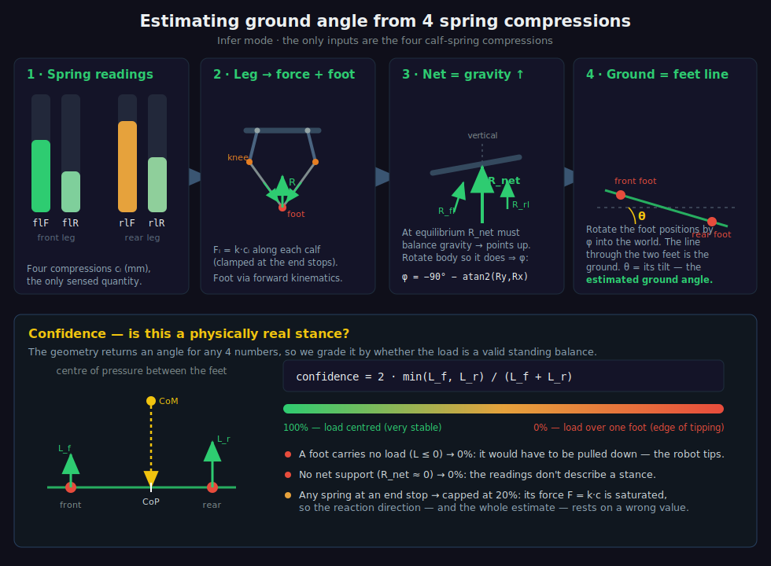

# Ground-Angle Inference from Spring Compressions

**Mode: "Infer" (springs → ground)** — implemented in
[`src/robot.js`](../src/robot.js) → `inferFromCompressions()`.

This document explains how the robot estimates the **ground angle** it is standing
on, using only the **four calf-spring compressions** it can measure, and how it
attaches a **confidence** to that estimate.



---

## The core idea

Each leg is a 5-bar linkage: two rigid thighs (servo angles) drop to two knees,
and two **calf springs** run from those knees to a single foot. The robot has two
such legs (a **front** and a **rear**), so there are **four calf springs** in
total, and four compression readings:

```
flF  flR      rlF  rlR
└ front leg ┘  └ rear leg ┘
```

The only thing the robot senses is how far each spring is compressed. From those
four numbers we want the **angle of the ground**.

The trick is one fact from statics:

> **At equilibrium, the sum of all ground-reaction forces must exactly balance
> gravity — so the *net* reaction points straight up (vertical).**

The springs tell us the *direction* of the net reaction in the robot's own body
frame. If we assume the readings come from a real standing equilibrium, then that
net reaction *is* the vertical, which pins how the body is tilted in the world.
Once the body's orientation is known, the line through the two feet (whose
positions come from the leg geometry) gives the ground angle.

Convention used throughout (inherited from the simulator): **+x is right, +y is
DOWN, gravity points +y.**

---

## Step 1 — Compression → measured calf force

Within its travel band a calf spring is linear:

```
Fᵢ = k · cᵢ            (k = spring rate, cᵢ = compression of calf i)
```

The compression surfaces have **end stops** at a minimum (preload) and a maximum
compression. Beyond either stop the strut goes rigid and the spring reading
**saturates** — the sensor cannot report the true (structural) force there. So the
*measurable* force the robot can actually use is the linear law **clamped to the
travel band**:

```
F_measured(c) = k · clamp(c, minComp, maxComp)
```

(`_measuredForce()` in the code.) This clamp matters later for confidence: a
reading sitting at a stop means the force value is wrong.

## Step 2 — Each leg → a reaction vector + a foot position

For one leg, the two calf forces act **along the calves** (from each knee toward
the shared foot). The ground reaction on that foot is the negative of their sum
(Newton's third law — the springs push the foot into the ground, the ground pushes
back):

```
R_leg = − Σ  F_measured(cᵢ) · ûᵢ        ûᵢ = unit(foot − kneeᵢ)
        i ∈ {front calf, rear calf}
```

The **foot position** itself comes from forward kinematics: given the thigh (servo)
angles and the two calf lengths (`L0 − cᵢ`), the foot is the lower intersection of
the two calf circles. (`Leg.solveForwardKinematics()`.)

So after Step 2 we have, in the **body frame**:

- `R_fl`, `R_rl` — the two per-leg reaction vectors, and
- `foot_fl`, `foot_rl` — the two foot positions.

## Step 3 — Net reaction must be vertical → body orientation

Add the two leg reactions to get the net reaction in the body frame:

```
R_net = R_fl + R_rl
```

At a real standing equilibrium `R_net` balances gravity, i.e. it points straight
**up** in the world. We therefore rotate the whole body by the angle `φ` that makes
`R_net` vertical:

```
φ = −90° − atan2(R_net.y, R_net.x)
```

`φ` is the **torso tilt** in the world. This is the heart of the method: the
springs give the reaction *direction in the body frame*, and gravity says that
direction *is* the world vertical, so the two together fix the body's orientation.

## Step 4 — Ground angle = line through the feet

Rotate the two foot positions by `φ` into world coordinates. The robot is standing
on both feet, so the **line joining the feet is the ground**, and the estimated
ground angle is simply its tilt from horizontal:

```
θ = atan2(foot_rl.y − foot_fl.y, foot_rl.x − foot_fl.x)
```

That `θ` is the inferred ground angle reported by the app.

---

## Confidence — is this a physically real stance?

The geometry above will return *some* angle for *any* four numbers, so we grade how
much to trust it. The test is whether the readings correspond to a **stable
standing configuration**: both feet must push the body **up**, and the weight must
fall **between** the feet.

Take the vertical component of each foot's reaction (its share of the load):

```
L_f = −R_fl.y      L_r = −R_rl.y      (after rotating into the world)
```

**Confidence is the centre-of-pressure margin** — how centred the load is between
the two feet:

```
confidence = 2 · min(L_f, L_r) / (L_f + L_r)        (×100 for a %)
```

- `100%` → load perfectly centred between the feet (very stable).
- `→ 0%`  → the load sits right over one foot (on the verge of tipping).

### Failure modes (confidence forced low)

| Situation | Confidence | Why |
|---|---|---|
| `R_net ≈ 0` or total load ≤ 0 | **0%** | The compressions don't add up to any net support — they don't describe a stance at all. |
| A foot's load `L ≤ 0` | **0%** | That foot would have to be *pulled down* to balance — impossible. The robot would tip; the angle is meaningless. |
| Any reading at/beyond an end stop | **capped at 20%** | The force `k·c` is **saturated** (Step 1), so the reaction direction — and hence the whole estimate — is built on a wrong number. |
| Otherwise | `2·min/Σ` | Trustworthy in proportion to how centred the load is. |

This is the key honest result of the project: **the reaction-angle method only
works while every spring is inside its travel band.** As the slope increases, the
uphill calf unloads toward its extension stop; once it saturates, the measured
force is wrong and confidence collapses — the app flags exactly when the estimate
can no longer be believed.

---

## Worked intuition

- **Flat ground, centred load.** All four springs read similar values → `R_fl` and
  `R_rl` are symmetric → `R_net` points straight down the body's own vertical →
  `φ = 0`, the feet line is level → `θ ≈ 0°`, confidence ≈ 100%.
- **Tilted ground (mild).** The downhill leg compresses more, the uphill leg less.
  The asymmetry rotates `R_net` in the body frame; forcing it vertical tilts the
  inferred body, and the feet line comes out at the true slope. Confidence is high
  while all springs stay in band.
- **Tilted ground (steeper).** The uphill calf reaches its extension stop. Its
  force reading saturates, the inferred angle drifts from the truth, and confidence
  is capped at 20% with a "spring at an end stop — force saturated" note.

---

## Assumptions & limitations

- **Single flat plane.** "Ground" is taken to be one straight line through both
  feet. Stairs/edges/independent per-foot terrain are not represented.
- **Quasi-static.** No momentum; the net reaction is assumed to equal gravity
  (true only when the robot is actually in static balance).
- **Needs in-band springs.** Saturated readings make the force law wrong; that is
  the dominant accuracy limit and is surfaced through the confidence value.
- **Two contacts.** Front/rear are treated as the two support points (in the real
  robot each represents a lateral pair).

## Where this lives in code

| Piece | Location |
|---|---|
| Whole inference pipeline | `inferFromCompressions()` in [`src/robot.js`](../src/robot.js) |
| Measured (saturating) force | `_measuredForce()` |
| Per-leg reaction vector | `_measuredLegReaction()` |
| Foot from forward kinematics | `Leg.solveForwardKinematics()` in [`src/leg.js`](../src/leg.js) |
| Readout / confidence display | `showInferOutputs()` in [`src/render.js`](../src/render.js) |
